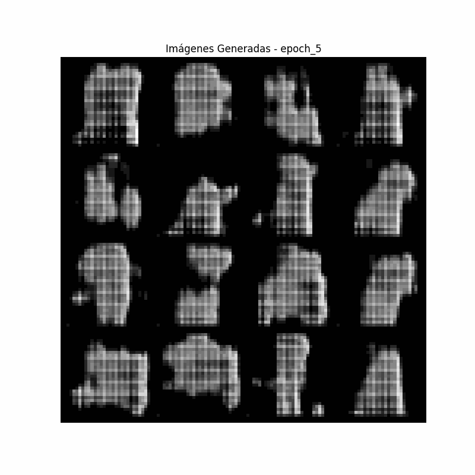

# GAN Prendas

Este repositorio contiene código para generar imágenes de prendas de ropa utilizando Redes Generativas Antagónicas (GANs). El proyecto tiene como objetivo crear imágenes de varios tipos de ropa entrenando un modelo GAN a partir del dataset FashionMNIST de PyTorch.

## Contenidos

- `gan_prendas.ipynb`: Notebook de Jupyter que contiene el código para entrenar la GAN y generar imágenes.
- `data/`: Directorio que contiene los datos del dataset.
- `images/`: Directorio que contiene las imágenes y GIFs generados.
- `models`: Directorio que contiene el modelo guardado a lo largo de su entrenamiento 
- `README.md`: Este archivo.

4. Ejecuta las celdas en el notebook para entrenar la GAN y generar imágenes.

## Resultados

Las imágenes generadas se pueden encontrar en el directorio images aunque el cuaderno muestra las imágenes generadas durante el proceso de entrenamiento, incluyendo un GIF al final del cuaderno y anteriormente en este archivo, con el recuento de todas las imagenes generadas para visualizar mejor el progreso del modelo generativo durante el entrenamiento.
